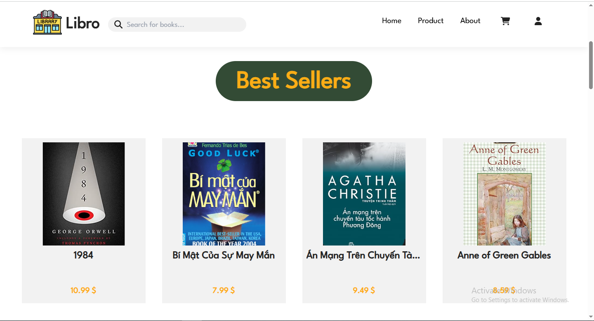
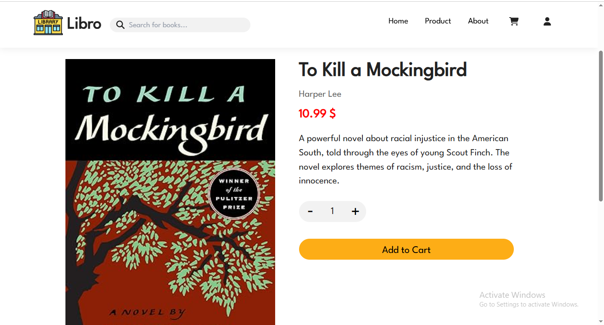
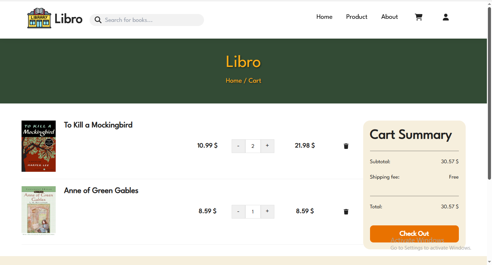

# 📚 BookStore App

A modern web application for an online bookstore that allows users to browse, search, and purchase books with ease.  
This project is designed as a full-stack application using **React** for the frontend and **Django** for the backend, suitable for both learning and real-world deployment.

---

## ✨ Features

- 🔐 User authentication: register, login, logout
- 🔎 Search and filter books by category, price, rating, etc.
- 🛒 Add books to cart and manage quantity
- 💳 Checkout and order confirmation

---

## 🛠️ Tech Stack

- Frontend: **React(Hook)**, **Tailwind CSS** for styling
- Backend: **Django**, **Django REST Framework**
- Database: **SQLite**
- Deployment: **Vercel** (frontend) + **Render** (backend hosting)

---

## 🚀 Quick Start

```bash
# Clone repository
git clone https://github.com/<your-username>/book-store-app.git
cd book-store-app

# ======================
# Backend Setup (Django)
# ======================
cd backend

# Create virtual environment
python -m venv env

# Activate virtual environment
source env/bin/activate      # macOS/Linux
env\Scripts\activate         # Windows

# Install dependencies
pip install -r requirements.txt

# Run migrations
python manage.py migrate

# Start backend server (http://127.0.0.1:8000)
python manage.py runserver

# ======================
# Frontend Setup (React)
# ======================
cd ../frontend

# Install dependencies
npm install

# Start frontend server (http://localhost:3000)
npm run dev
```

---

## 🌐 Demo

You can try the live version of the app here:  
👉 [BookStore App](https://book-store-app-two-chi.vercel.app)

### 🔎 Screenshots

#### 🏠 Homepage





#### 📚 Book Details



#### 🛒 Shopping Cart


